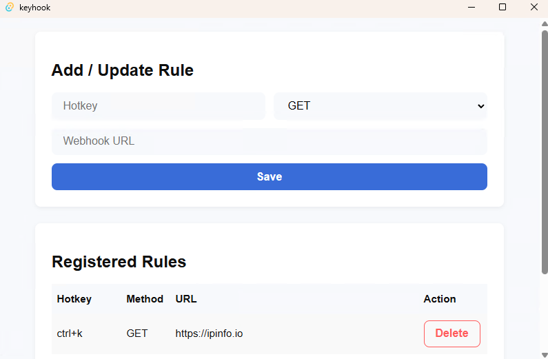
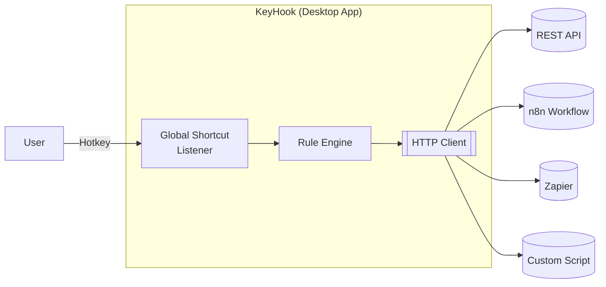

<!-- ─── Language Switch & ToC (top-right) ────────────────────────── -->

🇺🇸 English ·
<a href="README.zh-CN.md">🇨🇳 中文</a> &nbsp;&nbsp;&nbsp;&nbsp;&nbsp;&nbsp;|&nbsp;&nbsp;&nbsp;&nbsp;&nbsp; Table of Contents ↗️

<h1 align="center"><code>keyhook</code></h1>

  ⌨️ <strong>Global Hotkeys → Webhooks</strong> — one desktop app to trigger any HTTP request.

---

## ✨ Features

| Capability               | Details                                                                                           |
|--------------------------|---------------------------------------------------------------------------------------------------|
| 🔑 **Global shortcuts**  | System-wide hotkeys registered via `tauri-plugin-global-shortcut`.                                |
| 🌐 **Webhook actions**   | Fire `GET`, `POST`, `PUT`, `DELETE`, or `PATCH` requests &nbsp;(optional JSON body, 8 s timeout). |
| 🎛 **Live GUI**          | Yew + Trunk single-page app for adding, editing, deleting rules.                                  |
| 💾 **Persistent config** | Rules saved to a pretty-printed `keyhook.json` in the user-specific *app-config* directory.       |
| 🪟 **Tray mode**         | Runs in the system tray, auto-hides the main window, quit & show options.                         |
| 📜 **Structured logs**   | `tracing` output to console with UTC timestamps and log-level filtering (`KEYHOOK_LOG`).          |
| 📦 **Portable build**    | One binary per OS (`tauri bundle`), no runtime dependencies apart from system webview.            |

## 📸 Screenshots

## 🕸 Architecture

